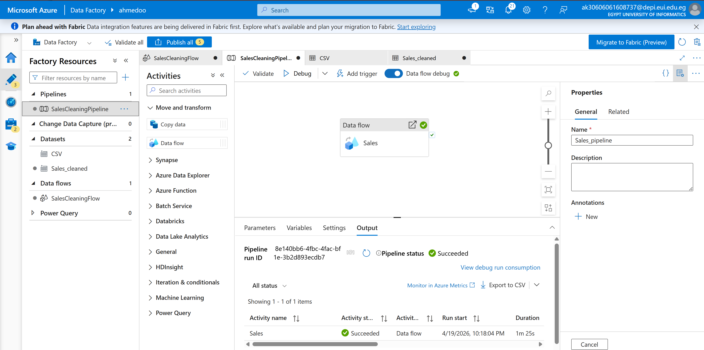
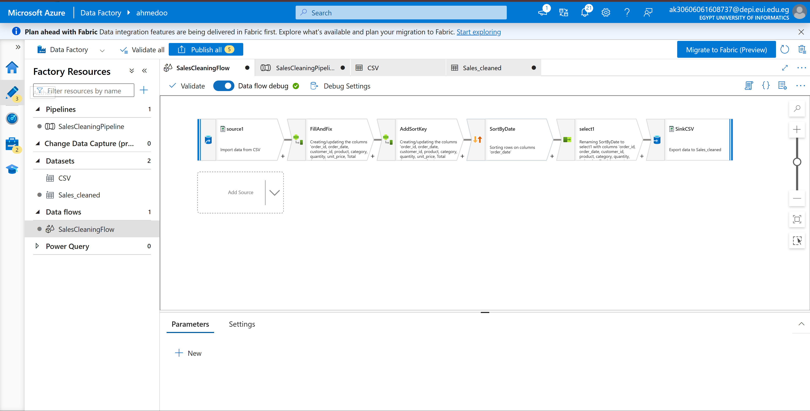
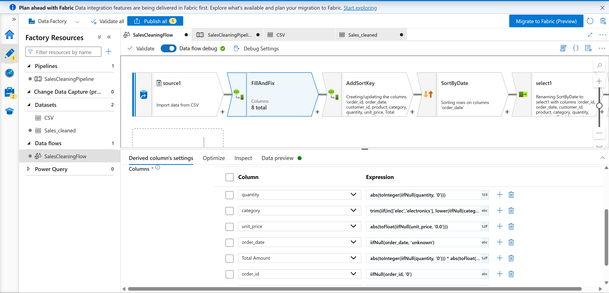
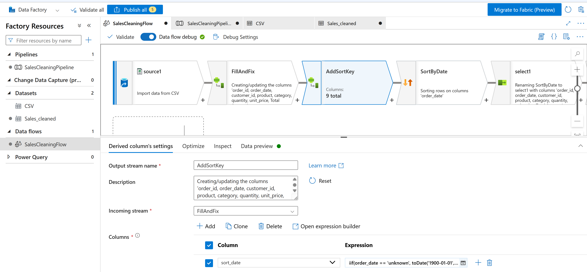
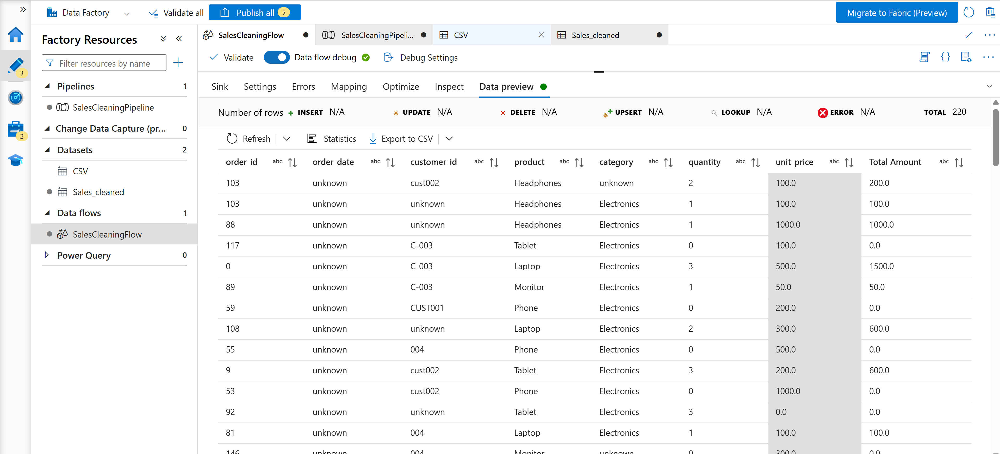

# 🏭 Azure Data Factory — Sales Data Cleaning Pipeline


An end-to-end **ETL Data Cleaning Pipeline** built using **Azure Data Factory (ADF)**.  
This project reads a raw `sales.csv` dataset, applies advanced data cleaning transformations using **Mapping Data Flow**, and saves the cleaned output into **Azure Data Lake Storage Gen2**.

---

# 📋 Project Overview

| Item | Details |
|------|---------|
| Tool | Azure Data Factory (ADF) |
| Source | `sales.csv` — Azure Data Lake Storage Gen2 (`input` container) |
| Output | `sales_cleaned.csv` — Azure Data Lake Storage Gen2 (`output` container) |
| Raw Rows | 221 rows |
| Rows Processed | 221 rows (no rows dropped) |
| Processing Type | Mapping Data Flow |
| Pipeline Status | ✅ Succeeded |

---

# 🔍 Data Issues Found in Raw CSV

The raw `sales.csv` dataset contained multiple data quality problems:

- ❌ Null values in:
  - `order_id`
  - `customer_id`
  - `product`
  - `order_date`
  - `quantity`
  - `unit_price`

- ❌ Inconsistent date formats:
  - `2024-01-01`
  - `01/02/2024`
  - `2024/04/05`
  - `March 3 2024`

- ❌ Inconsistent category values:
  - `Elec`
  - `electronics`
  - `Electronics`

- ❌ Negative values in:
  - `quantity`
  - `unit_price`
  - `Total Amount`

- ❌ Incorrect `Total Amount`
  (not matching `quantity × unit_price`)

- ❌ Wrong data types  
  (all columns initially read as strings)

---

# 🛠 Data Cleaning Strategy

All cleaning logic was implemented inside **Mapping Data Flow**.

### Transformations Applied:

- 🧹 Replace missing values
- 🔁 Standardize category values
- 📅 Normalize date formats
- 🔍 Convert data types
- ➕ Remove negative values
- 🧮 Recalculate Total Amount
- 📊 Sort records by valid dates
- 🧼 Preserve all original rows

---

# 🔄 Data Flow Pipeline

The pipeline consists of **6 connected transformations**:


source1 → FillAndFix → AddSortKey → SortByDate → DropSortKey → SinkCSV


---

# ⚙️ Transformation Details

## Step 1 — Source (`source1`)

Reads:


sales.csv


From:


Azure Data Lake Storage Gen2
(input container)


---


## Step 2 — Derived Column (`FillAndFix`)

Handles:

- Null replacement
- Category normalization
- Negative value removal
- Type conversion
- Total recalculation

### Expressions:

```
order_id      → iifNull(order_id, '0')

customer_id   → iifNull(customer_id, 'unknown')

product       → iifNull(product, 'unknown')

order_date    → iifNull(order_date, 'unknown')

category      → trim(
                   iif(
                       in(['elec','electronics'],
                       lower(iifNull(category,'unknown'))),
                       'Electronics',
                       iifNull(category,'unknown')
                   )
               )

quantity      → abs(
                   toInteger(
                       iifNull(quantity,'0')
                   )
               )

unit_price    → abs(
                   toFloat(
                       iifNull(unit_price,'0.0')
                   )
               )

{Total Amount}
→ abs(
      toInteger(iifNull(quantity,'0'))
  )
  *
  abs(
      toFloat(iifNull(unit_price,'0.0'))
  )
  ```
Step 3 — Derived Column (AddSortKey)

Creates helper column:

sort_date

Used to correctly sort mixed-format dates.

```
sort_date →

iif(order_date == 'unknown',
    toDate('1900-01-01','yyyy-MM-dd'),

iif(isDate(order_date,'yyyy-MM-dd'),
    toDate(order_date,'yyyy-MM-dd'),

iif(isDate(order_date,'MM/dd/yyyy'),
    toDate(order_date,'MM/dd/yyyy'),

iif(isDate(order_date,'yyyy/MM/dd'),
    toDate(order_date,'yyyy/MM-dd'),

    toDate(order_date,'MMMM d yyyy')
)))
```

✔ Rows with null dates receive:
`
1900-01-01
`
So they appear last after sorting.

Step 4 — Sort (SortByDate)

Sorts:
| Column      | Order      |
| ----------- | ---------- |
| `sort_date` | Descending |

Step 5 — Select (DropSortKey)

Removes:
`
sort_date
`
Final output keeps:
`
8 original columns
`
Step 6 — Sink (SinkCSV)

Writes cleaned dataset to:
`
Azure Data Lake Storage Gen2
(output container)
`
Output file:
``
sales_cleaned.csv
``
```
┌─────────┐   ┌────────────┐   ┌────────────┐   ┌────────────┐   ┌─────────────┐   ┌─────────┐
│ source1 │ → │ FillAndFix │ → │ AddSortKey │ → │ SortByDate │ → │ DropSortKey │ → │ SinkCSV │
└─────────┘   └────────────┘   └────────────┘   └────────────┘   └─────────────┘   └─────────┘
```
🧹 Null Handling Strategy

No rows were removed.
All 221 rows were preserved.
| Column         | Replacement Value |
| -------------- | ----------------- |
| `order_id`     | `'0'`             |
| `order_date`   | `'unknown'`       |
| `customer_id`  | `'unknown'`       |
| `product`      | `'unknown'`       |
| `category`     | `'unknown'`       |
| `quantity`     | `0`               |
| `unit_price`   | `0.0`             |
| `Total Amount` | recalculated      |

⚠️ Common Pitfalls & Fixes
| Error                    | Cause                         | Fix                                 |
| ------------------------ | ----------------------------- | ----------------------------------- |
| Expression type mismatch | Mixed numeric/string defaults | Use `'0'` then cast                 |
| Column not recognized    | Column contains spaces        | Use `{Total Amount}`                |
| Sorting incorrect        | String-based sorting          | Add `sort_date` column              |
| Negative totals          | Wrong calculation order       | Apply `abs()` before multiplication |

📦 Output

| File                | Description           |
| ------------------- | --------------------- |
| `sales_cleaned.csv` | Final cleaned dataset |
| Rows                | **221 rows**          |
| Columns             | **8 columns**         |

# 📸 Pipeline Screenshots

## Pipeline Overview



---

## Data Flow Design



---

## Fill and Fix Transformation



---

## Sorting Step



---

## Final Output


---
🛠 Tech Stack
| Tool                         | Purpose              |
| ---------------------------- | -------------------- |
| Azure Data Factory           | Cloud ETL Pipeline   |
| Azure Data Lake Storage Gen2 | Storage Layer        |
| Mapping Data Flow            | Data Cleaning Engine |
| CSV                          | Raw Dataset Format   |
---
📈 Key Achievements

✔ Cleaned 221 records

✔ Standardized multiple date formats

✔ Eliminated negative values

✔ Recalculated inconsistent totals

✔ Preserved full dataset integrity

✔ Built reusable ETL pipeline
---
👤 Author

Ahmed Samir
Junior Data Engineer — DEPI
B.Sc. Artificial Intelligence & Data Science — EJUST (2024–2028)

🐙 GitHub:
https://github.com/SAMIRJR002

💼 LinkedIn:
https://linkedin.com/in/ahmedsamir02

📧 Email:
ahmed.320240180@ejust.edu.eg
